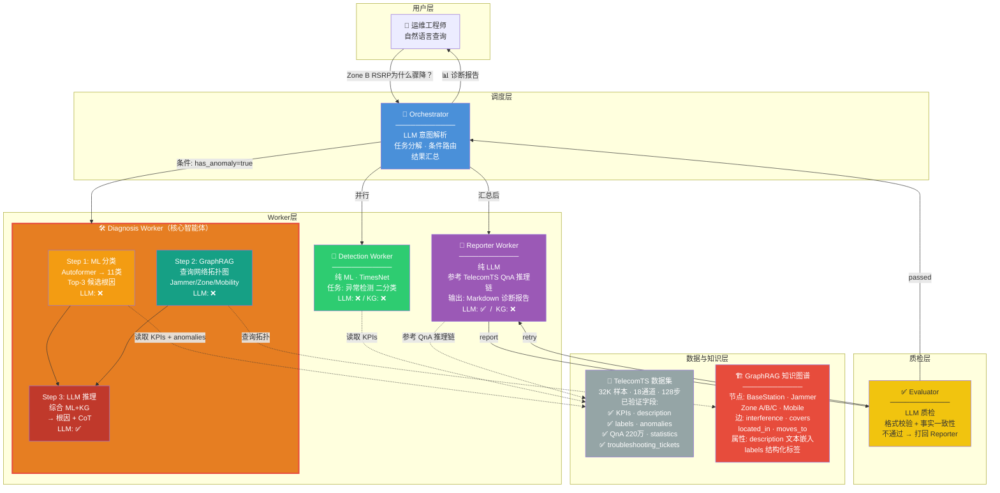
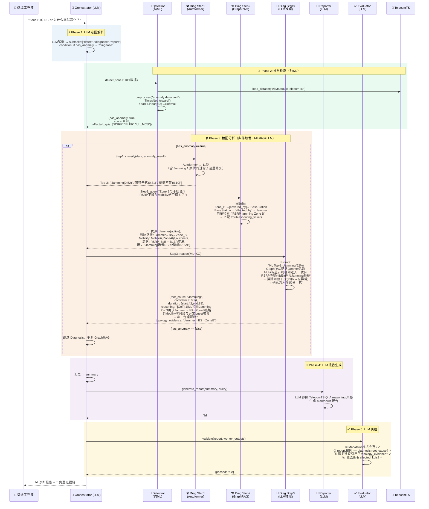
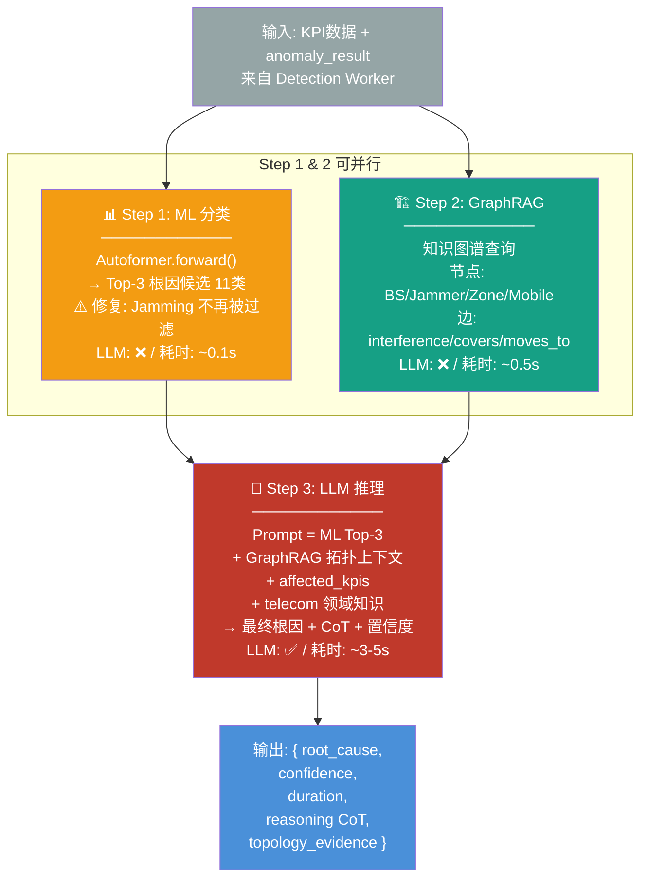
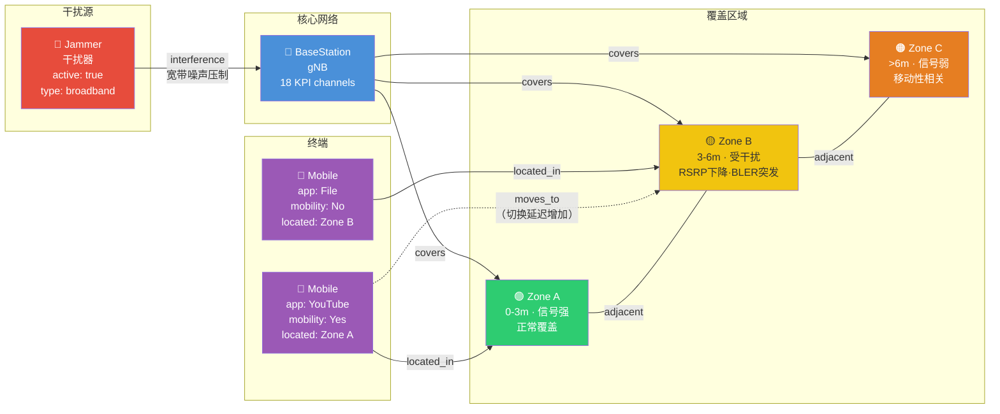
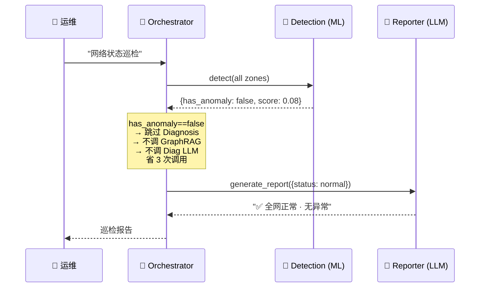
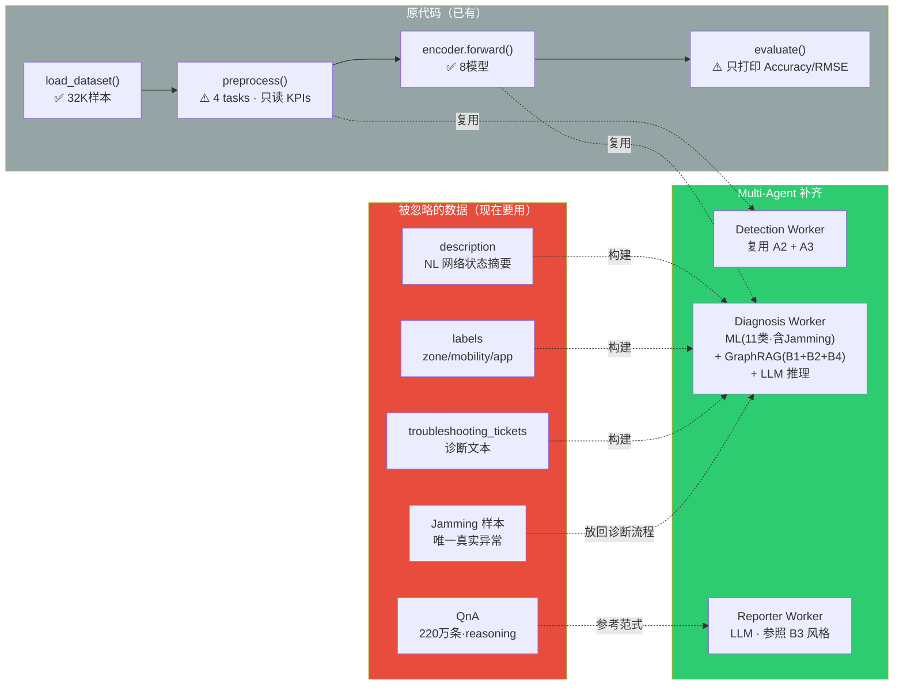
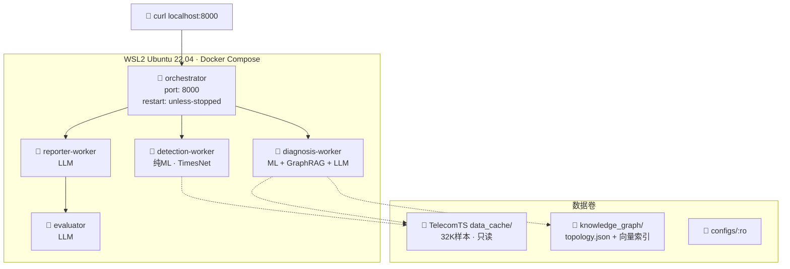

# BaseStation-MAS 系统架构文档

> **项目**: 5G 基站告警智能诊断系统  
> **架构模式**: Orchestrator-Worker-Evaluator（Supervisor + 3 异构 Worker）  
> **知识图谱**: 基于 TelecomTS Framework 图真实实体  
> **数据集**: TelecomTS 32K 样本 · 已下载到本地  
> **日期**: 2026-06-13 · v2.0

---

## 1. 系统架构全景图



---

## 2. 核心时序图：Jamming 干扰诊断



---

## 3. Diagnosis Worker 内部三级流水线



---

## 4. 知识图谱结构图



---

## 5. 条件分支：无异常场景



---

## 6. 数据流：原代码 gap → Multi-Agent 补齐



---

## 7. Docker 部署架构



---

## 8. Token / 时间预算

```
场景                        LLM调用              耗时       Token
─────────────────────────────────────────────────────────────
有异常 (Jamming诊断):
  Orchestrator 意图解析       1次                   ~1s       ~500
  Detection (ML)              0次                   ~0.01s    0
  Diagnosis ML (Autoformer)   0次                   ~0.1s     0
  Diagnosis GraphRAG          0次                   ~0.5s     0
  Diagnosis LLM 推理          1次                   ~4s       ~2000
  Reporter 报告生成           1次                   ~3s       ~1500
  Evaluator 质检              1次                   ~1s       ~800
  ─────────────────────────────────────────────────────────
  总计                       4次 LLM               ~10s      ~4800

无异常 (巡检):
  Orchestrator 意图解析       1次                   ~1s       ~500
  Detection (ML)              0次                   ~0.01s    0
  Reporter 简单报告           1次                   ~1s       ~500
  ─────────────────────────────────────────────────────────
  总计                       2次 LLM               ~2s       ~1000
```
